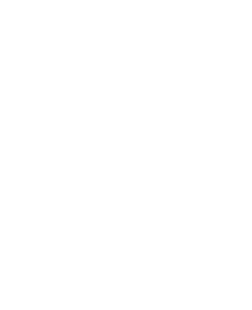

```ini
$ aatifetch
                  -`                        aatish@arch
                 .o+`                       ----------
                `ooo/                       Uptime: "19 years"
               `+oooo:                      Location: "Maharashtra, India"
              `+oooooo:                     Languages: ["C", "C++", "Dart", "Python"]
              -+oooooo+:                    Editor: "VS Code / Android Studio"
            `/:-:++oooo+:                   Interests: ["UI/UX", "Tech Enthusiast"]
           `/++++/++++++:                   Highlight Proj: "VolunEra - NGO Connect"
          `/+++++++++++++/`                      
         `/+++ooooooooooo/`                       
        ./ooosssso++osssssso+`                   
       .oossssso-````/ossssss+`                  
      -osssssso.      :ssssssso.                 
     :osssssss/        osssso+++.           Contacts
    /ossssssss/        +ssssooo/-           --------
  `/ossssso+/:-        -:/+osssso+-         Email: "contact@aatish.io"
 `+sso+:-`                 `.-/+oso:        Linkedin: "socials.aatish.io/linkedin"
`++:.                           `-/+/       Github: "socials.aatish.io/github"
.`                                 `.       Website: "aatish.io"
```

<br>

## About Me

Hey, I'm Aatish – a tech enthusiast who loves working with systems, gadgets, and UI/UX.  
I enjoy building clean, purposeful software, and diving deep into how things work under the hood – whether it's operating systems, smartphones, or web tech.

Studying Computer Science at Vishwakarma Institute of Technology, Pune

## Stuff I’ve Worked With

**Languages:** C, C++, Dart, Python  

**Frontend:** Flutter, HTML, CSS, JavaScript  

**Backend:** Firebase, Node.js  

**Tools:** VSCode, Android Studio, Git, Figma  

## Highlight Projects



### **Synapt**
[](https://github.com/aatishbagal/Synapt)

Multi-Device Search Utility connecting your files across all devices.


-FCC624?style=for-the-badge&logo=linux&logoColor=black)
-000000?style=for-the-badge&logo=apple&logoColor=white)

---


### **VolunEra** 
[](https://github.com/aatishbagal/volunera)

A full-stack web platform connecting volunteers and NGOs.


---

  
<!--  -->

### **RoadAware**
A smart road hazard detection and alert system for drivers.


---


### **Swapzo** 
[](https://github.com/aatishbagal/Swapzo)

A global platform that enables people to exchange anything — skills, services, or goods — directly without money.


---

## Contact Me

- Email: [contact@aatish.io](mailto:contact@aatish.io)  

- Website: [aatish.io](https://aatish.io)  

- GitHub: [github.com/aatishbagal](https://github.com/aatishbagal)  

- LinkedIn: [socials.aatish.io/linkedin](https://socials.aatish.io/linkedin)  
