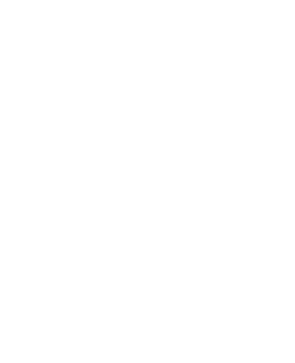
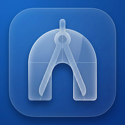

```ini
$ neofetch
                  -`                        aatish@arch
                 .o+`                       ----------
                `ooo/                       Uptime: "20 years"
               `+oooo:                      Location: "Maharashtra, India"
              `+oooooo:                     Studying: "CS @ VIT Pune"
              -+oooooo+:                    Languages: ["Rust", "C/C++", "Dart", "TypeScript"]
            `/:-:++oooo+:                   Editor: "VS Code + Claude Code"
           `/++++/++++++:                   Interests: ["Systems", "UI/UX", "Agentic Coding"]
          `/+++++++++++++/`                 Highlight Proj: "Synapt Toolchain"
         `/+++ooooooooooo/`
        ./ooosssso++osssssso+`
       .oossssso-````/ossssss+`
      -osssssso.      :ssssssso.
     :osssssss/        osssso+++.           Contacts
    /ossssssss/        +ssssooo/-           --------
  `/ossssso+/:-        -:/+osssso+-         Email: "contact@aatish.io"
 `+sso+:-`                 `.-/+oso:        Linkedin: "socials.aatish.io/linkedin"
`++:.                           `-/+/       Github: "socials.aatish.io/github"
.`                                 `.       Website: "aatish.io"
```

<br>

## About Me

Hey, I'm Aatish - a tech enthusiast who loves working with systems, gadgets, and UI/UX.
I enjoy building clean, purposeful software, and diving deep into how things work under the hood - whether it's operating systems, smartphones, or web tech.

Studying Computer Science at Vishwakarma Institute of Technology, Pune

## Stuff I've Worked With

**Languages**


**Frameworks**


**Backend & Data**


**Tools & Platforms**


## Highlight Projects



### Synapt Toolchain

A Ctrl+Space launcher that finds files and apps through a layered search pipeline (Bloom filter, prefix trie, tantivy full-text, fuzzy fallback), then pulls files straight off paired devices over the LAN. Pairing is secured with X25519 verification and ChaCha20-Poly1305 transfers. Ships signed, notarised installers for Linux, Windows and macOS from one pipeline, alongside **SynaptClip** for synced clipboard history.

[](https://synapt.aatish.io)
[](https://github.com/aatishbagal/synapt)
[](https://github.com/aatishbagal/synapt-clip)
[](https://github.com/aatishbagal/synapt-core)


---


### Traceway

A multi-tenant bug reporting and diagnostics platform with an organization and project dashboard, issue tracking, feature voting, community forums, and release management. Backed by a public REST ingestion API with Firebase Auth, Cloudflare R2 attachments, Upstash Redis rate limiting and realtime over Socket.IO, with a Flutter SDK as the first reference client.

[](https://traceway.dev)
[](https://docs.traceway.dev)


---



### MarbleArch

Generate marble patterns on the spot for architectural visualization. Live on the Apple App Store and Google Play with 160+ downloads, built and maintained end to end to app-store compliance standards.

[](https://marblearch.aatish.io)
[](https://play.google.com/store/apps/details?id=io.aatish.marblearch)
[](https://apps.apple.com/in/app/marblearch/id6757943152)


---

```
  _
 (_)_ ____   _____   __ _
 | | '_ \ \ / / _ \ / _' |
 | | | | \ V / (_) | (_| |
 |_|_| |_|\_/ \___/ \__, |
                       | |
                       |_|
```

### Invoq

A Linux terminal assistant that turns plain English into shell commands using local LLMs through Ollama, so nothing leaves the machine. Also explains commands and debugs whichever one just failed. Distributed via pip and pipx.

[](https://github.com/aatishbagal/invoq)


---


### RoadAware

A crowdsourced road hazard reporting system using motion-sensor auto-detection and GPS to alert drivers of nearby hazards in realtime. Includes a dedicated windshield HUD mode, with a computer-vision dash interface for lane and collision warnings in development.


## Contact Me

- Email: [contact@aatish.io](mailto:contact@aatish.io)
- Website: [aatish.io](https://aatish.io)
- GitHub: [github.com/aatishbagal](https://github.com/aatishbagal)
- LinkedIn: [socials.aatish.io/linkedin](https://socials.aatish.io/linkedin)
